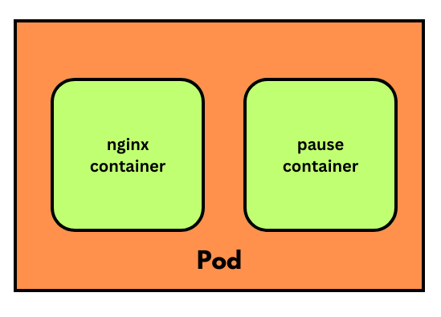

# Day 1

## Hypervisor Overview
<pre>
- is virtualization
- virtualization allows us to run many Operating System side by side on the same machine ( laptop/desktop/workstation/server )
- many OS can be running at the same time
- each VM requires
  - dedicated hardware resources
  - requires dedicated CPU Cores, RAM and disk 
- hence this kind of virtualization is considered as heavy-weight
- each Virtual Machine - represents one fully function operating system
- each Guest OS running within Virtual Machines has its own dedicated OS Kernel
- there are 2 types
  - Type 1 - Bare Metal Hypervisor ( Used in Workstations and Servers )
    - Virtual Machines can be created without installing Host OS
    - Examples
      - VMWare vSphere/Vcenter
  - Type 2 - ( Used in laptops/desktops/Workstations )
    - it can be installed on top of Host OS ( Windows/Linux/Mac )
    Examples
    - VMWare Fusion ( Earlier Paid software that works on Mac OS-X, it is made free by VMWare )
    - VMWare Workstation Pro ( Earlier Paid softwars that works in Linux and Windows, now it is completely free )
    - Oracle VirtualBox - Free ( works in Mac, Linux and Windows )
    - Microsoft Hyper-V
    - Parallels ( commercial product - works in Mac OS-X )
    - KVM - opensource Hypervisor that works in all Linux Distributions
</pre>

## Benefits of using Hypevisors
<pre>
- Server consolidation
- How many minimal physical servers are required to support 1000 Virtual Machines?
  - 1 Physical Server is enough
- Server Motherboards generally comes with Multiple Processor Sockets
- Processors are packaged in two ways
  Single Chip Module (SCM - Each Integrated Circuit will have 1 Processor )
  Multiple Chip Module (MCM - Each IC will have multiple Processors )
- Let's assume
  - the server supports 4 Processor Sockets
  - let's install each Socket with MCM based Processors i.e 1 Socket with 4 Processors
  - each Processor supports 128 CPU Cores
  - total CPU Cores 16 x 128 = 2048 Physical CPU Cores
  - total logic cores 16 x 128 x 2 = 4096 logical CPU Cores
  - Hyperthreading - each physical cpu core is capable of running 2 threads in parallel
  - each Physical CPU Core is seen as 2/4/8 logical cpu cores by Hypervisor software
  - let's assume each Physical CPU core supports 2 threads parallely
</pre>

## Hypervisor - High Level Architecture

## Linux Kernel - Container support
<pre>
- Namespace - helps in isolating one container from other containers
- Control Groups(CGroups ) - helps in applying resource quota restrictions at container level
  - Ex 
    - we can control the max RAM utilized by a container
    - we can apply a max limit on how many CPU cores a container can utilize at any point of time
    - can help in restrication how much disk/storage a container can use at the max
</pre>  

## Container Overview
<pre>
- light-weight virtualization technology
- is an application virtualization technology
- all containers running on a Host OS shares the hardware resources available to the Host OS
- each container represents one application( application process )
- containers don't represents Operating System
- container don't have their own OS Kernel as they are just application not a OS
- container will never be able to replace OS/Virtualization
</pre>

## Container Runtime Overview
<pre>
- container runtimes internally depends on the Linux Kernel features - Namespace and CGroups
- helps managing containers and images
- low-level softwares, not so user-friendly
- hence, normally end-users don't use these softwares directly
- Examples
  - runC - Container Runtime
  - CRI-O - Container Runtime
</pre>

## Container Engine Overview
<pre>
- container engines helps us manage containers and images
- high-level software, very user-friendly
- internally depends on Container Runtimes to manage images and containers
- Examples
  - Docker is a Container Engine
    - internally depends on containerd
    - containerd depends on runC Container Runtime
  - Podman is a Container Engine
    - internally depends on CRI-O Container Runtime
</pre>

## Docker Overview
<pre>
- Docker Inc organization developed Docker using Go lang
- Docker Engine comes in 2 flavours
  1. Docker Community Edition - Docker CE ( Free )
  2. Docker Enterprise Edition - Docker EE ( Paid )
</pre>

## Docker High-Level Architecture


## Why Red Hat Openshift supports only Podman and not Docker
<pre>
- Upto Red Hat Openshift v3.11, docker was the default container engine supported by Kubernetes and Openshift
- Docker had a security flaw, which gives administrative access to non-administrators
- There was a company called CoreOS with 2 interesting products
  1. rkt - container runtime
  2. Core OS - an operating system that enforces all best practices of Container Orchestration Platform
     - comes in 2 flavours
       - Fedora Core OS - opensource
       - Red Hat Enterpise Core OS ( RHCOS ) - used by paid variant of Openshift
- Red Hat acquired the Core OS company
  - they killed rkt container runtime, instead they developed CRI-O container runtime as an opensource product
  - Podman is the container engine which internally uses CRI-O container runtime
  - starting from Red Hat Openshift v4.x onwards
    - docker support was removed
    - openshift v4.x supports only CRI-O Container Runtime and Podman Container Engine
    - Red Hat Core Enterprise Core OS - is used in all master nodes within openshift
    - Red Hat Core Enterprise Core OS - can also be installed optionally in openshift worker nodes apart from RHEL  
</pre>

## Container Orchestration Platform Overview
<pre>
- though containers and images can be managed manually using Container Engines/runtimes, that is not the way it is used in the industry
- container orchestration platforms helps us manage containerized application workloads
- features supported
  - any containerized applications can be deployed 
  - High Availability (HA)
  - light-weight
  - allows deploying applications built in different programming languages
  - scale up/down manually/automatically
  - rolling update
    - helps in upgrading your application from one version to other without any downtime
    - can also undo i.e rollback to immediate previous version to any older version of the same application
  - service discovery
  - inbuilt monitoring facility
  - inbuilt load-balancing
  - security 
- Examples
  1. Docker SWARM
  2. Kubernetes
  3. Openshift
</pre>

## Docker SWARM Overview
<pre>
- Docker's native Container Orchestration Platform
- opensource
- supports deploying only a Docker based containerized application workloads
- it is easy to install and learn
- it is also very light-weight, i.e can be installed on laptops with an average hardware configuration
- it is generally used for learning, POC purpose
- not a production-grade Container Orchestration Platform
</pre>

## Kubernetes Overview
<pre>
- container orchestration platform
- supports many container runtimes and engines
- developed by Google in Go lang
- it is opensource
- supports only command-line
- production grade Container Orchestration Platform
- can be installed on laptops/desktops/workstation/server
- node can be
  - physical machine
  - can be a Virtual machine
  - can be an ec2 instance running in AWS
  - can be an azure VM from Azure cloud
- kubernetes cluster is a combination of many master nodes and many worker nodes
- it is even possible to create a single node Kubernetes cluster that acts as both master and worker node
- Kubernetes master nodes runs a special group of components called Control Plane Components
  - API Server
  - etcd database
  - Controller Managers
  - Scheduler
- Kubernetes supports extending Kubernetes API/features by adding your custom resources and custom controller
- Kubernetes master and nodes allow us to install any Linux distribution
- Kubernetes supports any container runtime/engine that implements CRI(Container Runtime Interface)
- AWS supports managed Kubernetes cluster called EKS
- Azure supports managed Kubernetes cluster called AKS
- Kubernetes provides all features to make it secure, but the ownus is us, it is not secured out of the box
</pre>

## Red Hat Openshift Overview
<pre>
- is Red Hat's Kubernetes distribution
- developed on top of opensource Google Kubernetes with many additional features
- it is a superset of Kubernetes, hence all features of Kubernetes are also supported in Openshift
- Red Hat Openshift supports only RHCOS in master nodes and either RHCOS/RHEL in worker nodes
- supports only CRI-O Container runtime and Podman Container engine
- enterprise product that requires commercial license
- supports many additional features
  - Web console
  - Internal Openshift Image Registry
  - Source to Image (S2I)
    - deploying application from source code
    - deploying application using Dockerfile
  - supports CI/CD
  - supports routes to expose application for external access
  - supports user management
- AWS supports managed Red Hat Openshift cluster called ROSA
  - Load Balancer creates an external Load Balancer supported by AWS
  
- Azure supports managed Red Hat Openshift cluster called ARO
  - Load Balancer creates an external Load Balancer supported by Azure

- As Red Hat Openshift makes use of Red Hat Enterprise Core OS, it is secure already
  - Ports below 1024 are not allowed as it is reserved for internal use
  - not all applications can be deployed with root access
  - it can be made more secure by using network policy like we do in Kubernetes
  - it will enforce best practices are followed which are not taken so seriously
</pre>

## Info - Openshift onPrem vs Cloud
<pre>
- onPrem Openshift 
  - installation of openshift we need to take care
  - Red Hat Openshift license are taken care by us
  - backup is our responsibility
  - we need to decide the master/worker node hardware configuration as per our application workload and user traffic
  - add new nodes into cluster is done manually using Openstack, VMWare vSphere, etc.,
  - Metallb operator or similar operators must be used to support LoadBalancer service in a on-prem openshift setup like our lab setup

- AWS ROSA
  - installation of openshift is taken care by AWS
  - Red Hat Openshift license is taken care by AWS
  - Hardware configuration of master nodes are decided and managed by AWS
  - backup of etcd database is taken care by AWS
  - LoadBalancer service when created it will automatically create AWS ALB/ELB as it is tighly integrated with AWS
</pre>

## Red Hat Openshift High-Level Architecture


## Pod Overview
<pre>
- a group of related containers
- one application per Pod is the general recommended best practice
- every Pod has a secret infra-container called pause-container which supports the networking features
- no Pod should contain more than one main application
- all the containers in the same Pod shares the same IP address and ports
</pre>


## Lab - Let's create an ubuntu container
```
docker run -dit --name ubuntu1 --hostname ubuntu1 ubuntu:latest /bin/bash
docker ps
```
In the above command
<pre>
run - will create a new container and starts the container
dit - deattached interactive terminal
name - ubuntu1 is the name of the container
hostname - ubuntu1 is the hostname of the container
ubuntu:latest - is the container image that will be downloaded from Docker Hub website and used to create the container
/bin/bash - is the shell that will be launched inside the container
</pre>

Expected output


## Let's create a second ubuntu container
```
docker run -dit --name ubuntu2-jegan --hostname ubuntu2-jegan ubuntu:latest /bin/bash
docker ps
```

Let's rename ubuntu1 container to ubuntu1-jegan
```
docker rename ubuntu1 ubuntu1-jegan
docker ps
```

Let's find the IP Address of ubuntu1-jegan and ubuntu2-jegan container
```
docker inspect -f {{.NetworkSettings.IPAddress}} ubuntu1-jegan
docker inspect -f {{.NetworkSettings.IPAddress}} ubuntu2-jegan
```

As you can notice, each container acquires a private IP address.

Expected output


## Lab - Let's understand, how containers get its IP address
Let's list the network types docker supports
```
docker network ls
docker network inspect bridge
```

Expected output

## Lab - Creating a custom network in docker
Listing the existing network types in docker
```
docker network ls
```

Create a custom docker network with a custom subnet
```
docker network create my-network --subnet 192.168.0.0/16
docker network ls
```

Create a new container and attach that to custom docker network
```
docker run -dit --name ubuntu1 --hostname ubuntu1 --network=my-network ubuntu:latest
docker inspect ubuntu1 | grep IPA
```


## Lab - Let's create a Pod using plain docker

Let's create a pause container which provides network
```
docker run -d --name jegan-pause-container --hostname nginx-jegan gcr.io/google_containers:pause-amd64:3.1
docker ps
```

Let's create a nginx web server container and connect to the pause container's network
```
docker run -d --name nginx-jegan --network=container:jegan-pause-container nginx:latest
docker ps
```

Let's find the IP address of pause container
```
docker inspect jegan-pause-container | grep IPA
```

Let's get inside the nginx-jegan container shell
```
docker exec -it nginx-jegan sh
hostname -i
exit
```

If you notice the IP address reported by jegan-pause-container and nginx-jegan are same. This is how, Pod is created in Kubernetes and Openshift.

## Lab - Let's check if we are able to access the openshift cluster
```
kubectl version
oc version
oc get nodes
kubectl get nodes
```

Expected output

