# Day 5

## Lab - Scheduling pods matching a specific node criteria
There are 2 types of Node Affinity possible
1. Preferred During Scheduling Ignored During Execution
2. Required During Scheduling Ignored During Execution

Preferred 
- If the scheduler will try to find a Node that matches the preferred criteria, if it find then it would deploy the Pod onto the node that matches the preferred condition
- If the scheduler is not able to find a Node that maches the preferred condition, then it will still deploy onto some node even though that doesn't meet that criteria
- Use cases
  - if the Pod prefers to run on a node that has SSD disk
  - if a .Net application prefers to run on a Windows Compute Node in OpenShift cluster

First if you can if there are any nodes that has disk=ssd label
```
oc get nodes -l disk=ssd
```

Assuming, there are no nodes that has the disk=ssd label, let's proceed.

```
cd ~/openshift-1620sep-2024
git pull

cd Day5/scheduling
oc apply -f preferred-affinity.yml
```

Let's check on which the pod is scheduled
```
oc get po -o wide
```

Let's now apply disk=ssd label to worker 2 node
```
oc label node worker02.ocp4.rps.com disk=ssd
```

If you notice, once the pod is scheduled even if the scheduler find a node that maches the node affinity condition put forth by the pod is available, the Pod won't be moved to the node that matches the criteria once it is already scheduled to some node in the Openshift cluster.

```
oc get po -o wide
```

Now, let's delete the pod
```
cd ~/openshift-1620sep-2024
```

## Lab - Scheduling pods matching a specific node criteria
There are 2 types of Node Affinity possible
1. Preferred During Scheduling Ignored During Execution
2. Required During Scheduling Ignored During Execution

Preferred 
- If the scheduler will try to find a Node that matches the preferred criteria, if it find then it would deploy the Pod onto the node that matches the preferred condition
- If the scheduler is not able to find a Node that maches the preferred condition, then it will still deploy onto some node even though that doesn't meet that criteria
- Use cases
  - if the Pod prefers to run on a node that has SSD disk
  - if a .Net application prefers to run on a Windows Compute Node in OpenShift cluster

First if you can if there are any nodes that has disk=ssd label
```
oc get nodes -l disk=ssd
```

Assuming, there are no nodes that has the disk=ssd label, let's proceed.

```
cd ~/openshift-1620sep-2024
git pull

cd Day5/scheduling
oc apply -f preferred-affinity.yml
```

Let's check on which the pod is scheduled
```
oc get po -o wide
```

Let's now apply disk=ssd label to worker 2 node
```
oc label node worker02.ocp4.rps.com disk=ssd
```

If you notice, once the pod is scheduled even if the scheduler find a node that maches the node affinity condition put forth by the pod is available, the Pod won't be moved to the node that matches the criteria once it is already scheduled to some node in the Openshift cluster.

```
oc get po -o wide
```

Now, let's delete the pod
```
cd ~/openshift-1620sep-2024

cd Day5/scheduling
oc delete -f preferred-affinity.yml
```

Now, let's remove the label from worker-2.ocp4.rps.com node
```
oc label worker02.ocp4.rps.com disk-
```
Expected output
<pre>
[jegan@tektutor.org scheduling]$ oc get nodes -l disk=ssd
No resources found
  
[jegan@tektutor.org scheduling]$ oc label node worker02.ocp4.rps.com disk=ssd
node/worker02.ocp4.rps.com labeled
  
[jegan@tektutor.org scheduling]$ oc get nodes -l disk=ssd
NAME                             STATUS   ROLES    AGE     VERSION
worker02.ocp4.rps.com   Ready    worker   7h25m   v1.27.6+f67aeb3
  
[jegan@tektutor.org scheduling]$ oc label node worker-2.ocp.tektutor.org.labs disk-
node/worker02.ocp4.rps.com unlabeled
  
[jegan@tektutor.org scheduling]$ oc get nodes -l disk=ssd
No resources found  
</pre>


Let's deploy the pod with required node affinity condition
```
cd ~/openshift-1620sep-2024

cd Day5/scheduling
oc apply -f required-affinity.yml
```

Let's check if the pod status
```
oc get po -o wide
```

Since, the scheduler is not able to find a node that has disk=ssd label, the Pod will remain the Pending status.

Now, let's apply the disk=ssd label to worker2
```
oc label node worker02.ocp4.rps.com disk=ssd
```

Now, let's list all the nodes that has label disk=ssd
```
oc get nodes -l disk=ssd
```

Now, we expect the pod to be deployed onto the worker2 as it meets the required criteria
```
oc get po -o wide
```

Finally, let's clean up the pod
```
oc delete -f required-affinity.yml
oc label node worker02.ocp4.rps.com disk-
```

## Lab - Deploying an angular js application into openshift using docker strategy
```
oc project
oc new-app https://github.com/tektutor/openshift-1620sep-2024.git --strategy=docker --context-dir=Day4/angular/Angular-openshift-example
oc get svc
oc expose svc/openshift-1620sep-2024
oc get route
```

Expected output


## Lab - BuildConfig
<pre>
- BuildConfig is a Openshift component/resource
- it is only supported in Openshift and not supported by Kubernetes
- S2I depends on BuildConfig
- In order to Build our custom applications from source code, BuildConfig resource is required
- BuildConfig
  - each time a new build runs, openshift creates an instance of BuildConfig called Build
  - the Build Controller creates a Pod based on Build parameters definied in the Build resource
  - Inside the Pod, the Build will clone the github repo
  - builds your application and produces application binary
  - prepares a Custom Container Image with your application binary
  - deploys the Custom Container Image into Openshift's Internal Registry
  - it supports source, docker S2I strategy
</pre>
	
First create an image stream where the newly built application image will be stored
```
cd ~/openshift-1620sep-2024
git pull
oc create imagestream tektutor-spring-hello
oc describe imagestream/tektutor-spring-hello
```

Expected output


Now we can create the build config
```
cd ~/openshift-1620sep-2024
git pull
cd Day5/BuildConfig
oc apply -f buildconfig.yml
oc logs -f bc/spring-hello
oc get imagestream
oc describe imagestream/tektutor-spring-hello
```
Expected output

## Lab - Buiding spring-boot sample microservice application using BuildConfig and push the image to Private JFrog Artifactory
This build config does the following
<pre>
- clones the github repo https://github.com/tektutor/openshift-sep-2024.git
- buids the java spring boot application under Day5/BuildConfig folder
- builds custom docker image and pushes the image to jfrogsep2024.jfrog.io
- it follows Docker strategy, hence it looks for Dockerfile under Day5/BuildConfig folder
- it follows the instructions in the Dockerfile
- in order to push image to private jfrog artifactory docker registry, it need JFrog Artifactory login credentials
- we also need to create a secret to capture the JFrog Artifactory login credentials so that BuildConfig can use it to push the image
</pre>

Create a secret with the JFrog Artifactory Login Credentials
```
oc create secret docker-registry private-jfrog-image-registry-new --docker-server=jfrogsep2024.jfrog.io --docker-username=your-jfrog-registered-email --docker-password=your-jfrog-password

oc get secrets
```
You need to update the buildconfig-pushto-artifactory.yml under Day5/BuildConfig to match the JFrog url and docker registry as per your JFrog setup. The start-build command, creates an instance of the buildconfig called Build. For each build, one Pod will be created to run the appliction build followed by image build.
```
cd ~/openshift-1620sep-2024
git pull

cd Day5/BuildConfig
oc apply -f buildconfig-pushto-artifactory.yml
oc get buildconfigs
oc start-build bc/hello
oc logs -f bc/hello
```

Expected output


## Info - What is Continuous Integration?
<pre>
- Jenkins - is a CI Build Server
- We can create a Jenkins Job - to monitor code commits done in GitHub/BitBucket or any version control
- Whenever Jenkins detects code commit in the version control, it will start the build
- As part of the CI Build, it will first clone the latest source code from GitHub/BitBucket code repository
- Then it will start the application build (maven build, dotnet build)
- As part of the build, you also have to have some automated test cases which runs part of the build
- If any test cases fails, the build will also fail
- If code is compiling and all test cases are executed successfully then the build will succeed.
</pre>

## Info - What is Continuous Deployment?
<pre>
- the dev team certified CI builds, will automatically deploy the application binaries into QA environment for further automated testing
- if all the automated test cases added by QA team succeeds then the build is good to go live in production
- it might require some manual approvals
</pre>

## Info - What is Continuous Delivery?
<pre>
- the QA certified build will automatically be deployed into pre-prod environment for the customer to check and approve to decide to make them live in production  
</pre>

## DevOps Overview
<pre>
- whatever technical work we deliver, we need to look for ways to convert them into source code
- openshift declarative style follows devops philosopy correctly
- as the openshift manifest yaml files are source code, we can push them into version control
- for build & test automation (CI/CD), the foremost important thing is the source code should be available in version control
</pre>

## What are the CI/CD Build Servers available ?
<pre>
- Jenkins is open source developed by Josuke Kavaguchi (former Sun Microsystem employee )
- Hudson was the original Build server that was built by Josuke Kavaguchi and open source community
- after Oracle acquired Sun Microsystems, due to some conflict in idealogy the Hudson team created a branch/fork called Jenkins and they quit Oracle and they started developing Jenkins as an opensource product
- Jenkins has more 10000 word-wide opensource contributors
- the commercial variant of Jenkins is called Cloudbees
- TeamCity
- Bamboo
- CircleCI
- TFS
- Tekton
</pre>

## Info - What is a Jenkins CI/CD Job?
<pre>
- could build application source and run automated test cases
- could build custom docker images
- could deploy application binaries to JFrog, Weblogic or JBoss
- could deploy application into Openshift
</pre>  

## Info - What is Jenkins Pipeline?
<pre>
- Pipelines involves many Jenkins Job that run one after the other in sequence or in parallel
- Pipelines consists of many Stages
- Each Stage will have one Jenkins Job
- When the First Stage Job succeeds it will trigger next downstream jenkins job in the pipeline
- If the second stage Job succeeds it will trigger the next downstream jenkins job in the pipeline
- this goes on until all the jobs complete successfully
- if any one of the stage fails, it won't trigger the next downstream jenkins job and the build will fail
</pre>


## Lab - Creating a JFrog Artifactory 14 days cloud trial

You need to create a trial JFrog Artifactory (14-days Cloud Trial) @ https://jfrog.com/start-free/#trialOptions with your personal gmail account (No credit cards required)
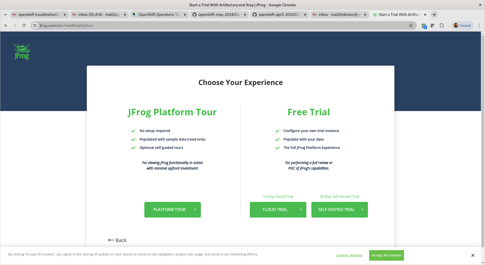

You could choose AWS ( they use their cloud account hence no charges are applicable to us - I didn't give my mobile number )
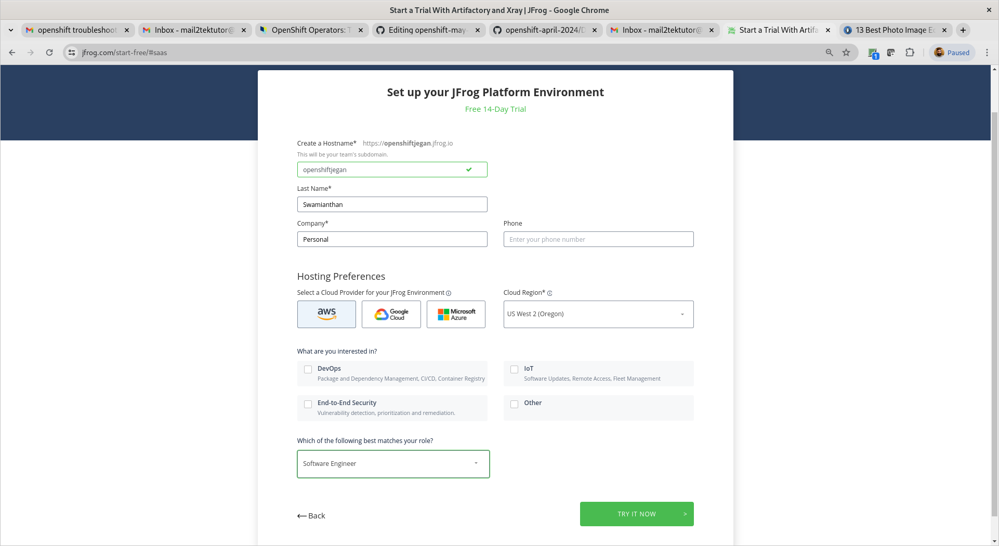
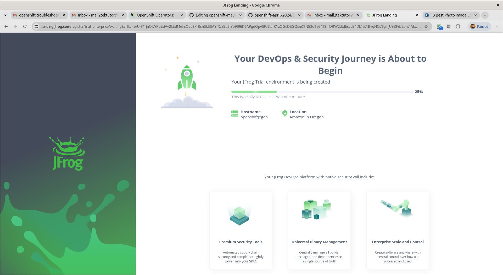

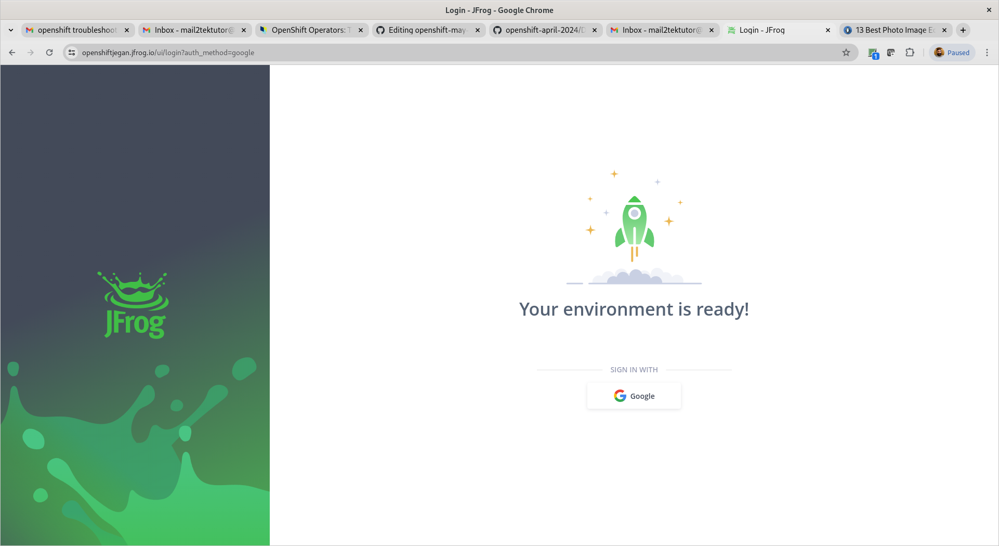

Now you should be able to login to your jfrog cloud with your gmail account that your registered with JFrog trial
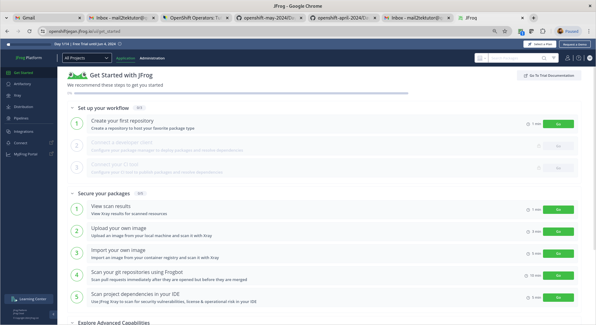

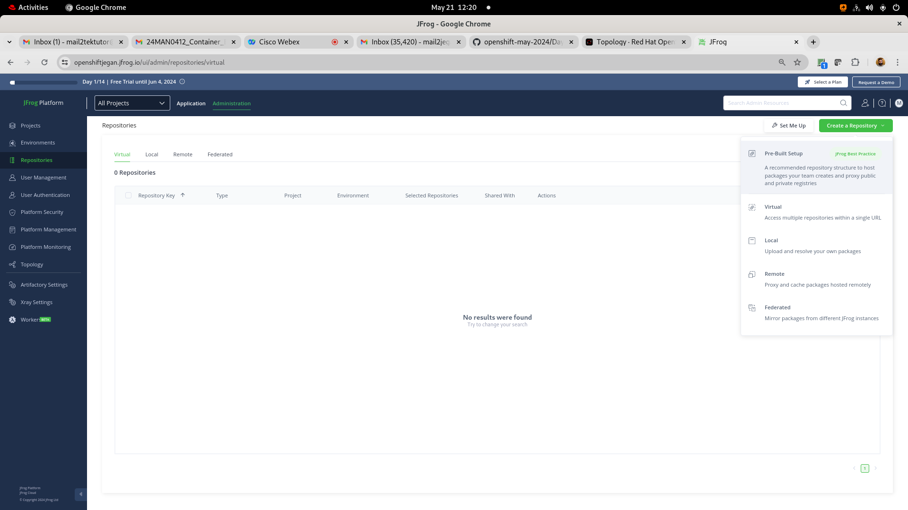
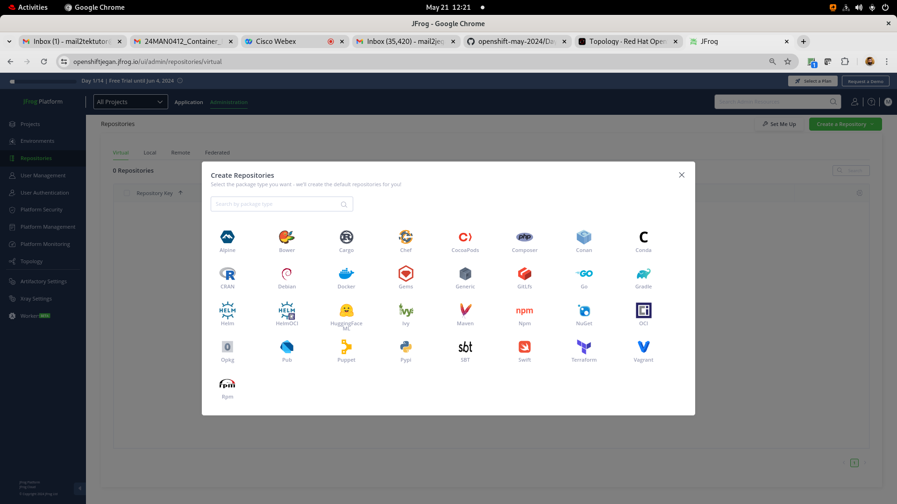
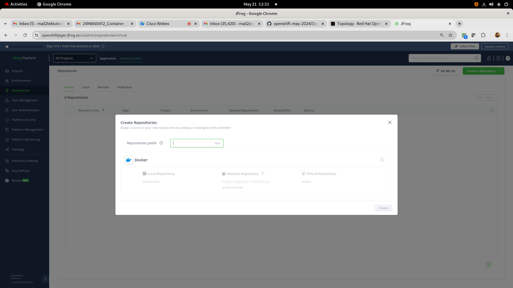
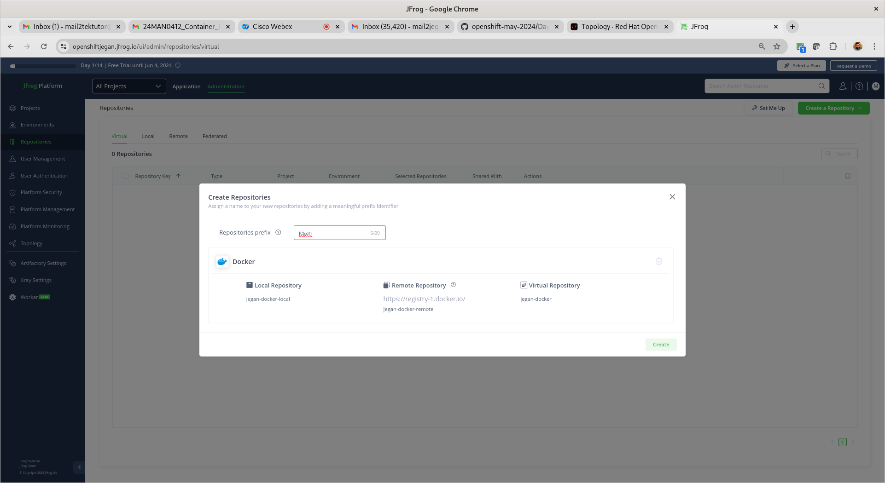
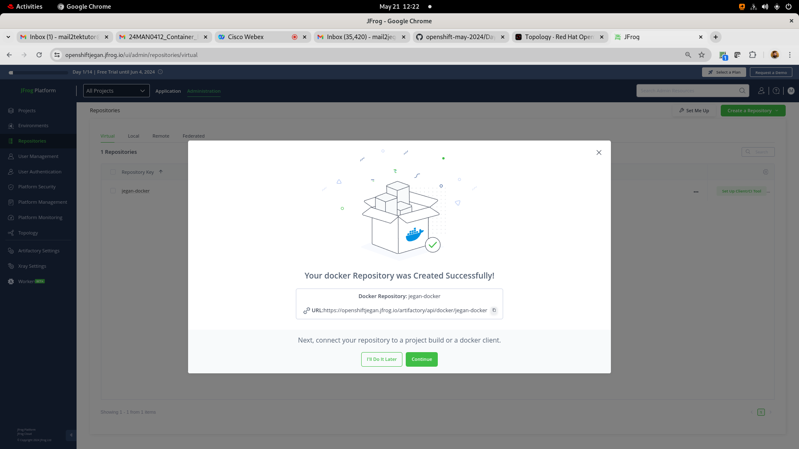
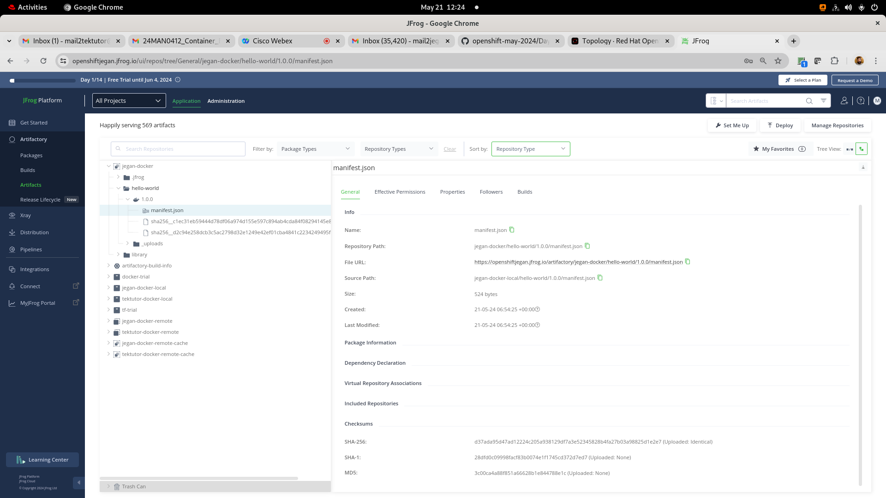

<pre>
jegan@tektutor.org $ docker login -umail2tektutor@gmail.com openshiftjegan.jfrog.io
Password: 
WARNING! Your password will be stored unencrypted in /home/jegan/.docker/config.json.
Configure a credential helper to remove this warning. See
https://docs.docker.com/engine/reference/commandline/login/#credentials-store

Login Succeeded
 jegan@tektutor.org % docker pull openshiftjegan.jfrog.io/jegan-docker/hello-world:latest
latest: Pulling from jegan-docker/hello-world
Digest: sha256:266b191e926f65542fa8daaec01a192c4d292bff79426f47300a046e1bc576fd
Status: Downloaded newer image for openshiftjegan.jfrog.io/jegan-docker/hello-world:latest
openshiftjegan.jfrog.io/jegan-docker/hello-world:latest
	
jegan@tektutor.org $ docker tag openshiftjegan.jfrog.io/jegan-docker/hello-world openshiftjegan.jfrog.io/jegan-docker/hello-world:1.0.0
	
jegan@tektutor.org $ docker push openshiftjegan.jfrog.io/jegan-docker/hello-world:1.0.0
The push refers to repository [openshiftjegan.jfrog.io/jegan-docker/hello-world]
ac28800ec8bb: Layer already exists 
1.0.0: digest: sha256:d37ada95d47ad12224c205a938129df7a3e52345828b4fa27b03a98825d1e2e7 size: 524
</pre>

## What makes the Serveless architecture work in Openshift or Kubernetes
<pre>
- You need to install OpenShift Serverless Operator
- The Serverless Operator installs knative serverless framework
</pre>

## Knative and Red Hat Servless
<pre>
- Red Hat Serverless is based on Knative opensource project
- Knative provides a serverless application layer on top of OpenShift/Kubernetes
- Knative consists of 3 building blocks
  - Build
  - Eventing
  - Serving
</pre>  

## What does Serverless mean ?
<pre>
- serverless doesn not mean the absence of servers
- is an architecture model for running applications in an environment that is abstracted away from developers
- developers can focus more on developing their application that where their code runs
- an ideal serverless workload executes a single task
- a function that retrieves data from a database can be an execellent serverless workload
- serverless model is the idea of the cold start
- when using serverless, there is a period between the request and creating the pod environment.  This period is called cold start.
- Examples
  - openshift serverless workloads follow this workflow
    - a request comes in
    - a pod is spun up to service the request
    - the serves the request
    - the pod is destroy when there is no user traffic to handle
    - your service will be scaled down all the way upto 0 pod when there is 0 zero
  - Another example of a serverless workload can be an image processing function
    - an event could be a photo upload. The uploaded photo triggers an event to run an application to process the image
    - For example, the application may overtext text, create a banner, or make thumbnail
    - Once the image is stored permanently, the application has served its purpose and is no longer needed
</pre>

## Serverless Features
<pre>
- Stateless Function
  - a function to query a database and return the data
  - a function to query weather report and return the data
- Event Driven
  - a serverless model relies on a trigger to execute the code
  - could be a request to an API or an event on a queue
- Auto Scales to zero
  - Being able to scale to zero means your code only runs when it needs to respond to an event
  - once the request is serverd, resources are release
</pre>

## Lab - Deploying your first knative service
```
kn service create hello \
--image ghcr.io/knative/helloworld-go:latest \
--port 8080
--env TARGET=World
```

Accessing the knative application from command line
```
curl -k https://hello-jegan-serverless.apps.ocp4.tektutor.org.labs
```

Expected output

#### Update the service
```
kn service update hello --env TARGET=Knative!
kn revisions list
```

Accessing the knative application from command line
```
curl -k https://hello-jegan-serverless.apps.ocp4.tektutor.org.labs
```


Expected output

Splitting the traffic between two revisions
```
kn service update hello --traffic hello-00001=50 --traffic @latest=50
kn revisions list
```
Expected output


Delete the knative service
```
kn service list
kn service delete hello
kn service list
```

Expected output

## Lab - Knative eventing

Let's deploy a sink service
```
oc project jegan-serverless
kn service create eventinghello --concurrency-target=1 --image=quay.io/rhdevelopers/eventinghello:0.0.2
```

Expected output

Let's create an event source application
```
kn source ping create eventinghello-ping-source --schedule="*/2 * * * *" --data '{"message": "Thanks for your message"}' --sink ksvc:eventinghello
```

Expected output

## Lab - Developing a simple knative function in nodejs and deploying into Openshift cluster

This will generate a basic nodejs application in your current directory
```
kn func create -l node
```

If you wish to build your application
```
kn func build
```

If you wish to run the application locally and test it
```
kn func run
```

Deploy the nodejs application into openshift after building it
```
kn func deploy -n jegan-serverless
```

Test the knative function
```
curl -k https://functions-jegan.apps.ocp4.tektutor.org.labs
```

Expected output

## Kubernetes/Openshift Network Model
For details information, you may refer
<pre>
https://kubernetes.io/docs/concepts/cluster-administration/networking/	
</pre>	

As we have good working knowledge in Kubernetes/Openshift, let's understand how Networking is done in Kubernetes/Openshift
<pre>
- As Openshift is based on Kubernetes, Openshift follows the same Kubernetes Networking Model
- Kubernetes hasn't implemented the Network, instead it has given some network specifications to allow third party vendors to implement the network fabrics following the Kubernetes Network Specification
- Kubernetes network model provides the foundation for understanding how containers, pods, and services within Kubernetes communicate with each other
- Kubernetes/Openshift Network specification says
  - Every pod gets its own IP address
  - Containers within a pod share the pod IP address and can communicate freely with each other
  - Pods can communicate with all other pods in the cluster using pod IP addresses (without NAT)
  - Pod to Pod communication restrictions should be possible by defining network policies
- Many third-party has implemented the above network specification in their own ways
- Some of the popular Network implementations are
  - Flannel, Calico and Weave from 3 different vendors
</pre>	

## Flannel Overview
<pre>
- one of the oldest and most mature CNI plugins available
- is a simple, lightweight layer 3 fabric for Kubernetes
- uses Overlay Network
- developed by CoreOS
- operates on Layer 3 of the OSI model and uses the VX-LAN as its default backend to move network packets between nodes
- provides access to basic networking features and requires limited amount of administration to set up and maintain
- supports a variety of backends like VX-LAN, host-gateway, AWS VPC, AliVPC, IPIP, and IPSec etc., 
- overlay network is a network that is layered on top of another network
- overlay network can be used to handle pod-to-pod traffic between nodes 
- Overlay networks work by encapsulating network packets
- when a pod initiates a connection to an IP address outside of the cluster, the node hosting the pod will use SNAT (Source Network Address Translation) to map the source address of the packet from the pod IP to the node IP
- is a great entry level choice for Kubernetes cluster networking
- drawbacks
  - doesn't support Network Policy
  - as each packets are encapsulated by sender and de-encapsulated by the receiver it impacts overvall network performance negatively
</pre>

## Calico Overview
<pre>
- Calico 
  - implemented by company called Tigera
  - comes in 2 flavours
    - opensource and
    - enterprise
  - most popular and commonly used in Kubernetes/Openshift CNI
  - provides both Network and Network Policy
  - operates on Layer 3 of the OSI model and uses the BGP(Border Gateway Protocol) protocol to move network packets between nodes
  - BGP is one of the fundamental building blocks of the internet, with exceptional scaling characteristics
  - Using BGP, Calico directs packets natively, without needing to wrap them in additional layers of encapsulation

</pre>	

## Weave Overview
<pre>
- is a flexible networking solution for Kubernetes/Openshift clusters
- developed by a company called WeaveWorks
- Weave comes in 2 flavours
  - opensource and paid
- weave routes packets using fast datapath method
- weave routes packets uses a slower network method called sleeve packet forward when fast datapath fails
- is easy to install and configure
- creates a mesh overlay network to connect all the nodes in the cluster
- Weave is a good choice for organizations that need a flexible and scalable networking solution for their Kubernetes/Openshift clusters	
</pre>

# Bonus Labs (Optional - not in our training agenda)

## Lab - Finding more details about Openshift Private Image Registry
Red Hat Openshift comes with a private Container Registry out of the box.  You may try extracting more details about the openshift image registry as shown below

```
oc describe svc/image-registry -n openshift-image-registry
```

Expected output
<pre>
[jegan@tektutor.org] $ oc describe svc/image-registry -n openshift-image-registry
Name:              image-registry
Namespace:         openshift-image-registry
Labels:            docker-registry=default
Annotations:       imageregistry.operator.openshift.io/checksum: sha256:1c19715a76014ae1d56140d6390a08f14f453c1a59dc36c15718f40c638ef63d
                   service.alpha.openshift.io/serving-cert-secret-name: image-registry-tls
                   service.alpha.openshift.io/serving-cert-signed-by: openshift-service-serving-signer@1710727234
                   service.beta.openshift.io/serving-cert-signed-by: openshift-service-serving-signer@1710727234
Selector:          docker-registry=default
Type:              ClusterIP
IP Family Policy:  SingleStack
IP Families:       IPv4
IP:                172.30.193.120
IPs:               172.30.193.120
Port:              5000-tcp  5000/TCP
TargetPort:        5000/TCP
Endpoints:         10.128.0.38:5000
Session Affinity:  None
Events:            <none>  
</pre>

## Lab - In case you are curious to see how does the etcd key/value data-store stores the data in openshift
In the below commands, replace 'jegan' with your project name(your name)

```
oc project openshift-etcd
oc rsh po/etcd-master-1.ocp4.rps.com
etcdctl get "" --keys-only --prefix=true
etcdctl get "" --keys-only --prefix=true | grep jegan
etcdctl get "/kubernetes.io/deployments/jegan/mariadb" --prefix=true
etcdctl get "/kubernetes.io/pods/jegan/mariadb-8469c94c8b-tf65s" --prefix=true
```

## Lab - Deploying a multipod java application that fetches data from mariadb database
```
cd ~/openshift-1620sep-2024
git pull

cd Day5/hello-microservice
mvn clean package

oc apply -f configmap.yml
oc apply -f secrets.yml
oc apply -f mariadb-pv.yml
oc apply -f mariadb-pvc.yml
oc apply -f mariadb-deploy.yml
oc apply -f mariadb-svc.yml

oc apply -f openshift-helloms-deploy.yml
oc apply -f openshift-helloms-svc.yml
oc apply -f openshift-helloms-route.yml
```

You can connect to mariadb pod shell as shown below, when it prompts for password type 'root@123'
```
oc rsh pod/mariadb-7889ddc665-9kskb
mysql -u root -p
CREATE DATABASE tektutor;
USE tektutor;
CREATE TABLE greeting ( message VARCHAR(100) NOT NULL );
INSERT INTO greeting VALUES ( "Hello Microservice 1.0 !" );
SELECT * FROM greeting;
```

Now you should be able to access the openshift helloms route from cli or web browser.  You need to use your route url which might look like http://openshift-hello-ms-<your-name>.apps.ocp4.rps.com
```
oc get route
curl http://openshift-hello-ms-jegan.apps.ocp4.rps.com
```

## Info - Troubleshooting NFS mount issues

Reference - https://docs.openshift.com/container-platform/4.14/storage/persistent_storage/persistent-storage-nfs.html

In case your Pods are unable to mount NFS shared folder, you need to enable nfs mounting within Openshift nodes as shown below

```
oc debug node/master-1.ocp4.training.tektutor
chroot /host /bin/bash
setsebool -P virt_use_nfs 1
exit

oc debug node/master-2.ocp4.training.tektutor
chroot /host /bin/bash
setsebool -P virt_use_nfs 1
exit

oc debug node/master-3.ocp4.training.tektutor
chroot /host /bin/bash
setsebool -P virt_use_nfs 1
exit

oc debug node/worker-1.ocp4.training.tektutor
chroot /host /bin/bash
setsebool -P virt_use_nfs 1
exit

oc debug node/worker-2.ocp4.training.tektutor
chroot /host /bin/bash
setsebool -P virt_use_nfs 1
exit
```

## Info - In case you are curious to see the containers running inside openshift nodes
```
oc debug node/worker-1.ocp4.training.tektutor
chroot /host /bin/bash
podman version
podman info
crictl ps -a
```

## Lab - Getting inside a Pod using its deployment name
```
oc rsh deploy/nginx
```

## Lab -  Getting inside a specific Pod shell
```
oc get po
oc rsh nginx-78644964b4-jg7wz
```

## Lab - Deploying application using a container image from OpenShift's Private Registry

Find the nginx image from your OpenShift private registry
```
oc get imagestream --all-namespaces | grep nginx
```
Expected output
<pre>
(jegan@tektutor.org)$ oc get imagestream --all-namespaces | grep nginx
jegan       nginx                                                image-registry.openshift-image-registry.svc:5000/jegan/nginx                                                    latest                                                   24 minutes ago
openshift   nginx                                                image-registry.openshift-image-registry.svc:5000/openshift/nginx                                                1.18-ubi7,1.18-ubi8,1.20-ubi7,1.20-ubi8 + 1 more...      2 days ago
</pre>

```
oc new-app image-registry.openshift-image-registry.svc:5000/jegan/nginx
```

You will have to replace the image with your image.


## Lab - Deploying an application using a container image from Docker Hub
```
oc new-app bitnami/nginx
```

Expected output
<pre>
(jegan@tektutor.org)$ oc new-app bitnami/nginx
--> Found container image 82fc406 (13 hours old) from Docker Hub for "bitnami/nginx"

    * An image stream tag will be created as "nginx:latest" that will track this image

--> Creating resources ...
    imagestream.image.openshift.io "nginx" created
    deployment.apps "nginx" created
    service "nginx" created
--> Success
    Application is not exposed. You can expose services to the outside world by executing one or more of the commands below:
     'oc expose service/nginx' 
    Run 'oc status' to view your app.
(jegan@tektutor.org)$ oc status
In project jegan on server https://api.ocp.tektutor.org:6443

svc/nginx - 172.30.57.123 ports 8080, 8443
  deployment/nginx deploys istag/nginx:latest 
    deployment #2 running for 14 seconds - 1 pod
    deployment #1 deployed 18 seconds ago

1 info identified, use 'oc status --suggest' to see details.
</pre>

## Blue Green vs Canary Deployment Strategy
- blue-green and Canary deployments are two popular strategies for continuous delivery
- aims to deliver software updates faster and more reliably
- both methods, allows us release new version of software without disrupting the existing service
- the main difference is that blue-green deployments switches all the traffic from old version(blue) to the new version(green) at once
- while canary deployments gradually exposes a small percentage of the traffic to the new version(canary) and monitor its performance and user behaviour before rolling it out to the wider audience****

## Info - Openshift Service
<pre>
- represents a groups of load-balanced pods from the same deployment
- service will forward the call to any one of the Pod within a single deployment
</pre>  

## Info - What is Ingress?
<pre>
- routing/forwarding rules
- Ingress helps in forwarding the calls to multiple different services pointing to different deployments
- Ingress is not a service
- We can declaratively create ingress rules, which are retreived by Ingress Controller, which then configures the load balancer with the forwarding rules we listing in the ingress
- For Ingress to work, we need the below
  - Ingress ( rules )
  - Ingress Controller
  - Load Balancer
</pre>

## Info - What is Ingress Controller?
- Ingress Controller is Controller like Deployment Controller, ReplicaSet Controller
- Ingress Controller keeps an eye on every new Ingress created in any project namespace
- Ingress Controller monitors any change done to existing Ingress resources under any project namespace
- Ingress Controller also will monitor when Ingress is deleted in any project namespace
- Ingress Controller picks the rules we mentioned in the Ingress resource and configures the load balancer accordingly
- There are two popular ingress controllers
  - Nginx Ingress Controller
  - HAProxy Ingress Controller
- In our lab setup, we are using HAProxy Load Balancer, hence we need to use HAProxy Ingress Controller

## Info - Deployment vs DeploymentConfigs
<pre>
- In older version of Kubernetes, we had to use ReplicationController to deploy applications into Kubernetes/Openshift
- The Red Hat openshift team, at that time added DeploymentConfig to allow deploying application in the declarative style as the ReplicationController doesn't support deploying application in the declarative style
- Meanwhile, the Google Kubernetes team & community added Deployment and ReplicaSet resource as an alternate for ReplicationController
- Hence, in Openshift the Red Hat team deprecated the use of DeploymentConfig as Deployment and DeploymentConfig pretty does the same
- Kubernetes, deprecated the use of ReplicationController
- Hence, whenever we deploy new appplication we need choose Deployment over the DeploymentConfig as DeploymentConfig internally uses ReplicationController
</pre>


## Info - ReplicationController vs ReplicaSet
- ReplicationController support both Rolling update and Scale up/down, which violates Single Responsibility Principle
- New applications should consider using Deployment over the ReplicationController
- When we create deployment, it automatically creates K8s Deployment resource and K8s ReplicaSet resource
- K8s Deployment resource is managed by Deployment Controller
- K8s ReplicaSet resource is managed by ReplicaSet Controller
- Deployment Controller supports rolling update
- ReplicaSet controller support scale up/down
- Hence, we should not use ReplicationController any more though it is there for backward compatibilty purpose
  
## Info - NodePort vs Route
<pre>
- NodePort is an external service
- It is a K8s features, which is also supported in openshift
- Kubernetes/Openshift reserve ports in range 30000-32767 for the purpose of NodePorts
- For each, NodePort service we create one of the ports from the above range will be alloted for the service
- the chose nodeport is opened in all the nodes for the nodeport service
- if we create 100 nodeport services, we end up opening 100 firewall ports on all the nodes, which is a security concern
- also nodeport service is not end-user friendly or developer friendly as they are accessed via node hostname/ip address, ideally the end-user should not have worry about about how many nodes are part of openshift
- routes is based on Kubernetes ingress, which provides an easy to access public url which is user-friendly as opposed to nodeport service
- hence, in openshift for internal service, we can create clusterip service
- for external access, we just need to expose the clusterip service as a route
- we don't have use node-port service in openshift
</pre>

## Reference - some additional Openshift info you might be interested
Red Hat Openshift also supports adding Windows Virtual Machines (nodes) into the Openshift cluster
<pre>
https://docs.openshift.com/container-platform/4.8/windows_containers/understanding-windows-container-workloads.html#understanding-windows-container-workloads
</pre>

cd Day5/scheduling
oc delete -f preferred-affinity.yml
```

Now, let's remove the label from worker-2.ocp4.rps.com node
```
oc label worker02.ocp4.rps.com disk-
```
Expected output
<pre>
[jegan@tektutor.org scheduling]$ oc get nodes -l disk=ssd
No resources found
  
[jegan@tektutor.org scheduling]$ oc label node worker02.ocp4.rps.com disk=ssd
node/worker02.ocp4.rps.com labeled
  
[jegan@tektutor.org scheduling]$ oc get nodes -l disk=ssd
NAME                             STATUS   ROLES    AGE     VERSION
worker02.ocp4.rps.com   Ready    worker   7h25m   v1.27.6+f67aeb3
  
[jegan@tektutor.org scheduling]$ oc label node worker-2.ocp.tektutor.org.labs disk-
node/worker02.ocp4.rps.com unlabeled
  
[jegan@tektutor.org scheduling]$ oc get nodes -l disk=ssd
No resources found  
</pre>


Let's deploy the pod with required node affinity condition
```
cd ~/openshift-1620sep-2024

cd Day5/scheduling
oc apply -f required-affinity.yml
```

Let's check if the pod status
```
oc get po -o wide
```

Since, the scheduler is not able to find a node that has disk=ssd label, the Pod will remain the Pending status.

Now, let's apply the disk=ssd label to worker2
```
oc label node worker02.ocp4.rps.com disk=ssd
```

Now, let's list all the nodes that has label disk=ssd
```
oc get nodes -l disk=ssd
```

Now, we expect the pod to be deployed onto the worker2 as it meets the required criteria
```
oc get po -o wide
```

Finally, let's clean up the pod
```
oc delete -f required-affinity.yml
oc label node worker02.ocp4.rps.com disk-
```

## Lab - Deploying an angular js application into openshift using docker strategy
```
oc project
oc new-app https://github.com/tektutor/openshift-1620sep-2024.git --strategy=docker --context-dir=Day5/angular/Angular-openshift-example
oc get svc
oc expose svc/openshift-1620sep-2024
oc get route
```

Expected output


## Lab - Creating an edge route for nginx deployment

Let's deploy nginx inside a project
```
oc new-project jegan
oc create deployment nginx --image=bitnami/nginx:latest --replicas=3
oc expose deploy/nginx --port=8080
```

Find your base domain of your openshift cluster
```
oc get ingresses.config/cluster -o jsonpath={.spec.domain}
```

Let's generate a private key
```
openssl version
openssl genrsa -out key.key
```

We need to create a public key using the private key with specific with your organization domain
```
openssl req -new -key key.key -out csr.csr -subj="/CN=nginx-jegan.apps.ocp4.tektutor.org.labs"
```

Sign the public key using the private key and generate certificate(.crt)
```
openssl x509 -req -in csr.csr -signkey key.key -out crt.crt
oc create route edge --service nginx --hostname nginx-jegan.apps.ocp4.tektutor.org.labs --key key.key --cert crt.crt
```

Expected output

## Lab - BuildConfig
<pre>
- BuildConfig is a Openshift component/resource
- it is only supported in Openshift and not supported by Kubernetes
- S2I depends on BuildConfig
- In order to Build our custom applications from source code, BuildConfig resource is required
- BuildConfig
  - each time a new build runs, openshift creates an instance of BuildConfig called Build
  - the Build Controller creates a Pod based on Build parameters definied in the Build resource
  - Inside the Pod, the Build will clone the github repo
  - builds your application and produces application binary
  - prepares a Custom Container Image with your application binary
  - deploys the Custom Container Image into Openshift's Internal Registry
  - it supports source, docker S2I strategy
</pre>
	
First create an image stream where the newly built application image will be stored
```
cd ~/openshift-1620sep-2024
git pull
cd Day5/BuildConfig
oc create imagestream tektutor-spring-hello
oc describe imagestream/tektutor-spring-hello
```

Expected output


Now we can create the build config
```
cd ~/openshift-1620sep-2024
git pull
cd Day5/BuildConfig
oc apply -f buildconfig.yml
oc logs -f bc/spring-hello
oc get imagestream
oc describe imagestream/tektutor-spring-hello
```
Expected output


## Lab - Buiding spring-boot sample microservice application using BuildConfig and push the image to Private JFrog Artifactory
This build config does the following
<pre>
- clones the github repo https://github.com/tektutor/openshift-sep-2024.git
- buids the java spring boot application under Day5/BuildConfig folder
- builds custom docker image and pushes the image to jfrogsep2024.jfrog.io
- it follows Docker strategy, hence it looks for Dockerfile under Day5/BuildConfig folder
- it follows the instructions in the Dockerfile
- in order to push image to private jfrog artifactory docker registry, it need JFrog Artifactory login credentials
- we also need to create a secret to capture the JFrog Artifactory login credentials so that BuildConfig can use it to push the image
</pre>

Create a secret with the JFrog Artifactory Login Credentials
```
oc create secret docker-registry private-jfrog-image-registry-new --docker-server=jfrogsep2024.jfrog.io --docker-username=your-jfrog-registered-email --docker-password=your-jfrog-password

oc get secrets
```
You need to update the buildconfig-pushto-artifactory.yml under Day5/BuildConfig to match the JFrog url and docker registry as per your JFrog setup. The start-build command, creates an instance of the buildconfig called Build. For each build, one Pod will be created to run the appliction build followed by image build.
```
cd ~/openshift-1620sep-2024
git pull

cd Day5/BuildConfig
oc apply -f buildconfig-pushto-artifactory.yml
oc get buildconfigs
oc start-build bc/hello
oc logs -f bc/hello
```

Expected output


## Info - What is Continuous Integration?
<pre>
- Jenkins - is a CI Build Server
- We can create a Jenkins Job - to monitor code commits done in GitHub/BitBucket or any version control
- Whenever Jenkins detects code commit in the version control, it will start the build
- As part of the CI Build, it will first clone the latest source code from GitHub/BitBucket code repository
- Then it will start the application build (maven build, dotnet build)
- As part of the build, you also have to have some automated test cases which runs part of the build
- If any test cases fails, the build will also fail
- If code is compiling and all test cases are executed successfully then the build will succeed.
</pre>

## Info - What is Continuous Deployment?
<pre>
- the dev team certified CI builds, will automatically deploy the application binaries into QA environment for further automated testing
- if all the automated test cases added by QA team succeeds then the build is good to go live in production
- it might require some manual approvals
</pre>

## Info - What is Continuous Delivery?
<pre>
- the QA certified build will automatically be deployed into pre-prod environment for the customer to check and approve to decide to make them live in production  
</pre>

## DevOps Overview
<pre>
- whatever technical work we deliver, we need to look for ways to convert them into source code
- openshift declarative style follows devops philosopy correctly
- as the openshift manifest yaml files are source code, we can push them into version control
- for build & test automation (CI/CD), the foremost important thing is the source code should be available in version control
</pre>

## What are the CI/CD Build Servers available ?
<pre>
- Jenkins is open source developed by Josuke Kavaguchi (former Sun Microsystem employee )
- Hudson was the original Build server that was built by Josuke Kavaguchi and open source community
- after Oracle acquired Sun Microsystems, due to some conflict in idealogy the Hudson team created a branch/fork called Jenkins and they quit Oracle and they started developing Jenkins as an opensource product
- Jenkins has more 10000 word-wide opensource contributors
- the commercial variant of Jenkins is called Cloudbees
- TeamCity
- Bamboo
- CircleCI
- TFS
- Tekton
</pre>

## Info - What is a Jenkins CI/CD Job?
<pre>
- could build application source and run automated test cases
- could build custom docker images
- could deploy application binaries to JFrog, Weblogic or JBoss
- could deploy application into Openshift
</pre>  

## Info - What is Jenkins Pipeline?
<pre>
- Pipelines involves many Jenkins Job that run one after the other in sequence or in parallel
- Pipelines consists of many Stages
- Each Stage will have one Jenkins Job
- When the First Stage Job succeeds it will trigger next downstream jenkins job in the pipeline
- If the second stage Job succeeds it will trigger the next downstream jenkins job in the pipeline
- this goes on until all the jobs complete successfully
- if any one of the stage fails, it won't trigger the next downstream jenkins job and the build will fail
</pre>


## Lab - Creating a JFrog Artifactory 14 days cloud trial

You need to create a trial JFrog Artifactory (14-days Cloud Trial) @ https://jfrog.com/start-free/#trialOptions with your personal gmail account (No credit cards required)


You could choose AWS ( they use their cloud account hence no charges are applicable to us - I didn't give my mobile number )


Now you should be able to login to your jfrog cloud with your gmail account that your registered with JFrog trial


<pre>
jegan@tektutor.org $ docker login -umail2tektutor@gmail.com openshiftjegan.jfrog.io
Password: 
WARNING! Your password will be stored unencrypted in /home/jegan/.docker/config.json.
Configure a credential helper to remove this warning. See
https://docs.docker.com/engine/reference/commandline/login/#credentials-store

Login Succeeded
 jegan@tektutor.org % docker pull openshiftjegan.jfrog.io/jegan-docker/hello-world:latest
latest: Pulling from jegan-docker/hello-world
Digest: sha256:266b191e926f65542fa8daaec01a192c4d292bff79426f47300a046e1bc576fd
Status: Downloaded newer image for openshiftjegan.jfrog.io/jegan-docker/hello-world:latest
openshiftjegan.jfrog.io/jegan-docker/hello-world:latest
	
jegan@tektutor.org $ docker tag openshiftjegan.jfrog.io/jegan-docker/hello-world openshiftjegan.jfrog.io/jegan-docker/hello-world:1.0.0
	
jegan@tektutor.org $ docker push openshiftjegan.jfrog.io/jegan-docker/hello-world:1.0.0
The push refers to repository [openshiftjegan.jfrog.io/jegan-docker/hello-world]
ac28800ec8bb: Layer already exists 
1.0.0: digest: sha256:d37ada95d47ad12224c205a938129df7a3e52345828b4fa27b03a98825d1e2e7 size: 524
</pre>

## What makes the Serveless architecture work in Openshift or Kubernetes
<pre>
- You need to install OpenShift Serverless Operator
- The Serverless Operator installs knative serverless framework
</pre>

## Knative and Red Hat Servless
<pre>
- Red Hat Serverless is based on Knative opensource project
- Knative provides a serverless application layer on top of OpenShift/Kubernetes
- Knative consists of 3 building blocks
  - Build
  - Eventing
  - Serving
</pre>  

## What does Serverless mean ?
<pre>
- serverless doesn not mean the absence of servers
- is an architecture model for running applications in an environment that is abstracted away from developers
- developers can focus more on developing their application that where their code runs
- an ideal serverless workload executes a single task
- a function that retrieves data from a database can be an execellent serverless workload
- serverless model is the idea of the cold start
- when using serverless, there is a period between the request and creating the pod environment.  This period is called cold start.
- Examples
  - openshift serverless workloads follow this workflow
    - a request comes in
    - a pod is spun up to service the request
    - the serves the request
    - the pod is destroy when there is no user traffic to handle
    - your service will be scaled down all the way upto 0 pod when there is 0 zero
  - Another example of a serverless workload can be an image processing function
    - an event could be a photo upload. The uploaded photo triggers an event to run an application to process the image
    - For example, the application may overtext text, create a banner, or make thumbnail
    - Once the image is stored permanently, the application has served its purpose and is no longer needed
</pre>

## Serverless Features
<pre>
- Stateless Function
  - a function to query a database and return the data
  - a function to query weather report and return the data
- Event Driven
  - a serverless model relies on a trigger to execute the code
  - could be a request to an API or an event on a queue
- Auto Scales to zero
  - Being able to scale to zero means your code only runs when it needs to respond to an event
  - once the request is serverd, resources are release
</pre>

## Lab - Deploying your first knative service
```
kn service create hello \
--image ghcr.io/knative/helloworld-go:latest \
--port 8080
--env TARGET=World
```

Accessing the knative application from command line
```
curl -k https://hello-jegan-serverless.apps.ocp4.tektutor.org.labs
```

Expected output

#### Update the service
```
kn service update hello --env TARGET=Knative!
kn revisions list
```

Accessing the knative application from command line
```
curl -k https://hello-jegan-serverless.apps.ocp4.tektutor.org.labs
```


Expected output

Splitting the traffic between two revisions
```
kn service update hello --traffic hello-00001=50 --traffic @latest=50
kn revisions list
```
Expected output


Delete the knative service
```
kn service list
kn service delete hello
kn service list
```

Expected output

## Lab - Knative eventing

Let's deploy a sink service
```
oc project jegan-serverless
kn service create eventinghello --concurrency-target=1 --image=quay.io/rhdevelopers/eventinghello:0.0.2
```

Expected output

Let's create an event source application
```
kn source ping create eventinghello-ping-source --schedule="*/2 * * * *" --data '{"message": "Thanks for your message"}' --sink ksvc:eventinghello
```

Expected output

## Lab - Developing a simple knative function in nodejs and deploying into Openshift cluster

This will generate a basic nodejs application in your current directory
```
kn func create -l node
```

If you wish to build your application
```
kn func build
```

If you wish to run the application locally and test it
```
kn func run
```

Deploy the nodejs application into openshift after building it
```
kn func deploy -n jegan-serverless
```

Test the knative function
```
curl -k https://functions-jegan.apps.ocp4.tektutor.org.labs
```

Expected output

## Kubernetes/Openshift Network Model
For details information, you may refer
<pre>
https://kubernetes.io/docs/concepts/cluster-administration/networking/	
</pre>	

As we have good working knowledge in Kubernetes/Openshift, let's understand how Networking is done in Kubernetes/Openshift
<pre>
- As Openshift is based on Kubernetes, Openshift follows the same Kubernetes Networking Model
- Kubernetes hasn't implemented the Network, instead it has given some network specifications to allow third party vendors to implement the network fabrics following the Kubernetes Network Specification
- Kubernetes network model provides the foundation for understanding how containers, pods, and services within Kubernetes communicate with each other
- Kubernetes/Openshift Network specification says
  - Every pod gets its own IP address
  - Containers within a pod share the pod IP address and can communicate freely with each other
  - Pods can communicate with all other pods in the cluster using pod IP addresses (without NAT)
  - Pod to Pod communication restrictions should be possible by defining network policies
- Many third-party has implemented the above network specification in their own ways
- Some of the popular Network implementations are
  - Flannel, Calico and Weave from 3 different vendors
</pre>	

## Flannel Overview
<pre>
- one of the oldest and most mature CNI plugins available
- is a simple, lightweight layer 3 fabric for Kubernetes
- uses Overlay Network
- developed by CoreOS
- operates on Layer 3 of the OSI model and uses the VX-LAN as its default backend to move network packets between nodes
- provides access to basic networking features and requires limited amount of administration to set up and maintain
- supports a variety of backends like VX-LAN, host-gateway, AWS VPC, AliVPC, IPIP, and IPSec etc., 
- overlay network is a network that is layered on top of another network
- overlay network can be used to handle pod-to-pod traffic between nodes 
- Overlay networks work by encapsulating network packets
- when a pod initiates a connection to an IP address outside of the cluster, the node hosting the pod will use SNAT (Source Network Address Translation) to map the source address of the packet from the pod IP to the node IP
- is a great entry level choice for Kubernetes cluster networking
- drawbacks
  - doesn't support Network Policy
  - as each packets are encapsulated by sender and de-encapsulated by the receiver it impacts overvall network performance negatively
</pre>

## Calico Overview
<pre>
- Calico 
  - implemented by company called Tigera
  - comes in 2 flavours
    - opensource and
    - enterprise
  - most popular and commonly used in Kubernetes/Openshift CNI
  - provides both Network and Network Policy
  - operates on Layer 3 of the OSI model and uses the BGP(Border Gateway Protocol) protocol to move network packets between nodes
  - BGP is one of the fundamental building blocks of the internet, with exceptional scaling characteristics
  - Using BGP, Calico directs packets natively, without needing to wrap them in additional layers of encapsulation

</pre>	

## Weave Overview
<pre>
- is a flexible networking solution for Kubernetes/Openshift clusters
- developed by a company called WeaveWorks
- Weave comes in 2 flavours
  - opensource and paid
- weave routes packets using fast datapath method
- weave routes packets uses a slower network method called sleeve packet forward when fast datapath fails
- is easy to install and configure
- creates a mesh overlay network to connect all the nodes in the cluster
- Weave is a good choice for organizations that need a flexible and scalable networking solution for their Kubernetes/Openshift clusters	
</pre>

# Bonus Labs (Optional - not in our training agenda)

## Lab - Finding more details about Openshift Private Image Registry
Red Hat Openshift comes with a private Container Registry out of the box.  You may try extracting more details about the openshift image registry as shown below

```
oc describe svc/image-registry -n openshift-image-registry
```

Expected output
<pre>
[jegan@tektutor.org] $ oc describe svc/image-registry -n openshift-image-registry
Name:              image-registry
Namespace:         openshift-image-registry
Labels:            docker-registry=default
Annotations:       imageregistry.operator.openshift.io/checksum: sha256:1c19715a76014ae1d56140d6390a08f14f453c1a59dc36c15718f40c638ef63d
                   service.alpha.openshift.io/serving-cert-secret-name: image-registry-tls
                   service.alpha.openshift.io/serving-cert-signed-by: openshift-service-serving-signer@1710727234
                   service.beta.openshift.io/serving-cert-signed-by: openshift-service-serving-signer@1710727234
Selector:          docker-registry=default
Type:              ClusterIP
IP Family Policy:  SingleStack
IP Families:       IPv4
IP:                172.30.193.120
IPs:               172.30.193.120
Port:              5000-tcp  5000/TCP
TargetPort:        5000/TCP
Endpoints:         10.128.0.38:5000
Session Affinity:  None
Events:            <none>  
</pre>

## Lab - In case you are curious to see how does the etcd key/value data-store stores the data in openshift
In the below commands, replace 'jegan' with your project name(your name)

```
oc project openshift-etcd
oc rsh po/etcd-master-1.ocp4.rps.com
etcdctl get "" --keys-only --prefix=true
etcdctl get "" --keys-only --prefix=true | grep jegan
etcdctl get "/kubernetes.io/deployments/jegan/mariadb" --prefix=true
etcdctl get "/kubernetes.io/pods/jegan/mariadb-8469c94c8b-tf65s" --prefix=true
```

## Lab - Deploying a multipod java application that fetches data from mariadb database
```
cd ~/openshift-1620sep-2024
git pull

cd Day5/hello-microservice
mvn clean package

oc apply -f configmap.yml
oc apply -f secrets.yml
oc apply -f mariadb-pv.yml
oc apply -f mariadb-pvc.yml
oc apply -f mariadb-deploy.yml
oc apply -f mariadb-svc.yml

oc apply -f openshift-helloms-deploy.yml
oc apply -f openshift-helloms-svc.yml
oc apply -f openshift-helloms-route.yml
```

You can connect to mariadb pod shell as shown below, when it prompts for password type 'root@123'
```
oc rsh pod/mariadb-7889ddc665-9kskb
mysql -u root -p
CREATE DATABASE tektutor;
USE tektutor;
CREATE TABLE greeting ( message VARCHAR(100) NOT NULL );
INSERT INTO greeting VALUES ( "Hello Microservice 1.0 !" );
SELECT * FROM greeting;
```

Now you should be able to access the openshift helloms route from cli or web browser.  You need to use your route url which might look like http://openshift-hello-ms-<your-name>.apps.ocp4.rps.com
```
oc get route
curl http://openshift-hello-ms-jegan.apps.ocp4.rps.com
```

## Info - Troubleshooting NFS mount issues

Reference - https://docs.openshift.com/container-platform/4.14/storage/persistent_storage/persistent-storage-nfs.html

In case your Pods are unable to mount NFS shared folder, you need to enable nfs mounting within Openshift nodes as shown below

```
oc debug node/master-1.ocp4.training.tektutor
chroot /host /bin/bash
setsebool -P virt_use_nfs 1
exit

oc debug node/master-2.ocp4.training.tektutor
chroot /host /bin/bash
setsebool -P virt_use_nfs 1
exit

oc debug node/master-3.ocp4.training.tektutor
chroot /host /bin/bash
setsebool -P virt_use_nfs 1
exit

oc debug node/worker-1.ocp4.training.tektutor
chroot /host /bin/bash
setsebool -P virt_use_nfs 1
exit

oc debug node/worker-2.ocp4.training.tektutor
chroot /host /bin/bash
setsebool -P virt_use_nfs 1
exit
```

## Info - In case you are curious to see the containers running inside openshift nodes
```
oc debug node/worker-1.ocp4.training.tektutor
chroot /host /bin/bash
podman version
podman info
crictl ps -a
```

## Lab - Getting inside a Pod using its deployment name
```
oc rsh deploy/nginx
```

## Lab -  Getting inside a specific Pod shell
```
oc get po
oc rsh nginx-78644964b4-jg7wz
```

## Lab - Deploying application using a container image from OpenShift's Private Registry

Find the nginx image from your OpenShift private registry
```
oc get imagestream --all-namespaces | grep nginx
```
Expected output
<pre>
(jegan@tektutor.org)$ oc get imagestream --all-namespaces | grep nginx
jegan       nginx                                                image-registry.openshift-image-registry.svc:5000/jegan/nginx                                                    latest                                                   24 minutes ago
openshift   nginx                                                image-registry.openshift-image-registry.svc:5000/openshift/nginx                                                1.18-ubi7,1.18-ubi8,1.20-ubi7,1.20-ubi8 + 1 more...      2 days ago
</pre>

```
oc new-app image-registry.openshift-image-registry.svc:5000/jegan/nginx
```

You will have to replace the image with your image.


## Lab - Deploying an application using a container image from Docker Hub
```
oc new-app bitnami/nginx
```

Expected output
<pre>
(jegan@tektutor.org)$ oc new-app bitnami/nginx
--> Found container image 82fc406 (13 hours old) from Docker Hub for "bitnami/nginx"

    * An image stream tag will be created as "nginx:latest" that will track this image

--> Creating resources ...
    imagestream.image.openshift.io "nginx" created
    deployment.apps "nginx" created
    service "nginx" created
--> Success
    Application is not exposed. You can expose services to the outside world by executing one or more of the commands below:
     'oc expose service/nginx' 
    Run 'oc status' to view your app.
(jegan@tektutor.org)$ oc status
In project jegan on server https://api.ocp.tektutor.org:6443

svc/nginx - 172.30.57.123 ports 8080, 8443
  deployment/nginx deploys istag/nginx:latest 
    deployment #2 running for 14 seconds - 1 pod
    deployment #1 deployed 18 seconds ago

1 info identified, use 'oc status --suggest' to see details.
</pre>

## Blue Green vs Canary Deployment Strategy
- blue-green and Canary deployments are two popular strategies for continuous delivery
- aims to deliver software updates faster and more reliably
- both methods, allows us release new version of software without disrupting the existing service
- the main difference is that blue-green deployments switches all the traffic from old version(blue) to the new version(green) at once
- while canary deployments gradually exposes a small percentage of the traffic to the new version(canary) and monitor its performance and user behaviour before rolling it out to the wider audience****

## Info - Openshift Service
<pre>
- represents a groups of load-balanced pods from the same deployment
- service will forward the call to any one of the Pod within a single deployment
</pre>  

## Info - What is Ingress?
<pre>
- routing/forwarding rules
- Ingress helps in forwarding the calls to multiple different services pointing to different deployments
- Ingress is not a service
- We can declaratively create ingress rules, which are retreived by Ingress Controller, which then configures the load balancer with the forwarding rules we listing in the ingress
- For Ingress to work, we need the below
  - Ingress ( rules )
  - Ingress Controller
  - Load Balancer
</pre>

## Info - What is Ingress Controller?
- Ingress Controller is Controller like Deployment Controller, ReplicaSet Controller
- Ingress Controller keeps an eye on every new Ingress created in any project namespace
- Ingress Controller monitors any change done to existing Ingress resources under any project namespace
- Ingress Controller also will monitor when Ingress is deleted in any project namespace
- Ingress Controller picks the rules we mentioned in the Ingress resource and configures the load balancer accordingly
- There are two popular ingress controllers
  - Nginx Ingress Controller
  - HAProxy Ingress Controller
- In our lab setup, we are using HAProxy Load Balancer, hence we need to use HAProxy Ingress Controller

## Info - Deployment vs DeploymentConfigs
<pre>
- In older version of Kubernetes, we had to use ReplicationController to deploy applications into Kubernetes/Openshift
- The Red Hat openshift team, at that time added DeploymentConfig to allow deploying application in the declarative style as the ReplicationController doesn't support deploying application in the declarative style
- Meanwhile, the Google Kubernetes team & community added Deployment and ReplicaSet resource as an alternate for ReplicationController
- Hence, in Openshift the Red Hat team deprecated the use of DeploymentConfig as Deployment and DeploymentConfig pretty does the same
- Kubernetes, deprecated the use of ReplicationController
- Hence, whenever we deploy new appplication we need choose Deployment over the DeploymentConfig as DeploymentConfig internally uses ReplicationController
</pre>


## Info - ReplicationController vs ReplicaSet
- ReplicationController support both Rolling update and Scale up/down, which violates Single Responsibility Principle
- New applications should consider using Deployment over the ReplicationController
- When we create deployment, it automatically creates K8s Deployment resource and K8s ReplicaSet resource
- K8s Deployment resource is managed by Deployment Controller
- K8s ReplicaSet resource is managed by ReplicaSet Controller
- Deployment Controller supports rolling update
- ReplicaSet controller support scale up/down
- Hence, we should not use ReplicationController any more though it is there for backward compatibilty purpose
  
## Info - NodePort vs Route
<pre>
- NodePort is an external service
- It is a K8s features, which is also supported in openshift
- Kubernetes/Openshift reserve ports in range 30000-32767 for the purpose of NodePorts
- For each, NodePort service we create one of the ports from the above range will be alloted for the service
- the chose nodeport is opened in all the nodes for the nodeport service
- if we create 100 nodeport services, we end up opening 100 firewall ports on all the nodes, which is a security concern
- also nodeport service is not end-user friendly or developer friendly as they are accessed via node hostname/ip address, ideally the end-user should not have worry about about how many nodes are part of openshift
- routes is based on Kubernetes ingress, which provides an easy to access public url which is user-friendly as opposed to nodeport service
- hence, in openshift for internal service, we can create clusterip service
- for external access, we just need to expose the clusterip service as a route
- we don't have use node-port service in openshift
</pre>

## Reference - some additional Openshift info you might be interested
Red Hat Openshift also supports adding Windows Virtual Machines (nodes) into the Openshift cluster
<pre>
https://docs.openshift.com/container-platform/4.8/windows_containers/understanding-windows-container-workloads.html#understanding-windows-container-workloads
</pre>
